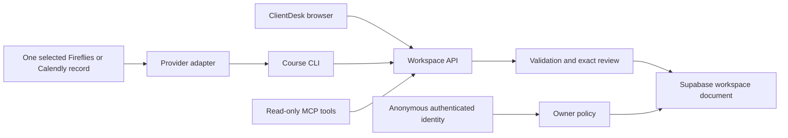

# How the working surfaces connect



The browser, CLI and MCP use the same domain contract. They do not automatically share an identity. Server validation checks the requested change; database policy isolates the owner; versioned updates preserve simultaneous changes.

The hosted implementation stores typed clients, meetings, events and tasks in one versioned JSON document per owner. See the planning decision record for why this bounded course release differs from the original four-table proposal. Live provider calls require separately supplied credentials and were not run during this build.

```text
Walkthrough Assets/
├── CLAUDE.md                    project orientation
├── .mcp.json                    course tool registration
└── .claude/
    ├── rules/interface.md       reusable UI rules
    └── skills/client-brief/
        ├── SKILL.md             name, arguments and evidence workflow
        ├── templates/brief.md   repeatable output
        └── tests/cases.md       expected and failure cases
```

## Local chat path

Local browser → chat route → authenticated workspace → selected-client context → installed Claude Code in print mode → answer in the panel. The model has no direct database or file tools. The server refreshes its context on each question. Chat history is kept per client in page memory. The Vercel app disables this bridge. See 01-planning/REBUILD-GUIDE.md for the plain-English build instructions.

## Hosted chat path

Browser → Vercel chat route → authenticated Supabase workspace → bounded selected-client evidence → authenticated Railway service → Claude Code print mode → answer. The browser never receives the service credential. Railway has no database credential. A separate access code restricts the demonstration. Source facts carry IDs; chat has no tools or write actions. Temporary model sessions are removed after each request; only login refresh data and usage counters persist on Railway. See 05-deployment/HOSTED-CLAUDE-CHAT.md for the current deployment checkpoint.
