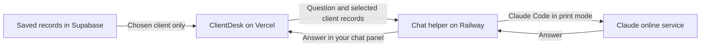

# How ClientDesk’s hosted chat works

A **worker** is a small program that handles a request behind the scenes. In this app, its job is to receive a question, run Claude with the selected client’s records, and return an answer. We also call it the **chat helper**.

Railway supplies the online computer. The worker is our program running on that computer. Claude Code is installed there and contacts Claude’s online service. This arrangement can keep working when your laptop is closed.

For example, you ask **“What did Maya request?”** in Northstar’s chat. Vercel reads your workspace, selects Northstar’s records and sends them with your question. The helper runs `claude -p`. Claude returns an answer citing the supplied meeting. The helper checks that the run succeeded and the result has the expected structure, then returns it to your chat panel. You still compare the answer with the original meeting to check its facts.

The helper receives a limited selection of records. It does not search every client, browse the course folder, or fetch new Fireflies meetings by itself. This chat can draft a suggestion, but the separate review-and-save flow controls saved tasks.

## The words you will see

| Term | Meaning in this build |
| --- | --- |
| Server | An online computer that receives requests |
| Service | Our program running on that computer |
| Headless | The app operates Claude without someone using Claude’s interactive chat screen |
| Print mode, `-p` | Claude processes the supplied request, returns a result and exits |
| Dockerfile / Docker image | The packaging recipe / the resulting package containing the program and its required software |
| Pinned version | The same recorded software version each time, so an update does not silently change the build |
| Persistent volume | A saved folder that remains when Railway replaces the running program |
| Deploy / redeploy | Put the program online / publish a fresh running version |
| Environment variable | A named setting supplied to the program, such as an address or private credential |
| Authenticated request | A request whose required identity or credentials have been checked |
| Origin | A website’s base address: scheme, hostname and any port, without a page path or query |
| Timeout | A time limit that stops a request from waiting indefinitely |
| Type check | An automated check that the code uses the expected kinds of values |

The saved Railway folder is `/data`. It holds the dedicated Claude login and usage counters. The app’s saved client records live separately in Supabase.

## Which address and code goes where?

| Item | Who uses it? | Where it belongs |
| --- | --- | --- |
| Vercel app address | Learners opening ClientDesk | The browser |
| Railway helper address | Vercel sending a chat request | Vercel setting `CLIENTDESK_CHAT_URL` |
| Private service credential | Vercel identifying itself to Railway | Same value in Vercel `CLIENTDESK_CHAT_TOKEN` and Railway `CHAT_SERVICE_TOKEN` |
| Course access code | Learners allowed to use course chat | Learners enter it in the panel. The host stores it as Railway `CHAT_ACCESS_CODE` |
| Claude account login | Claude Code on the Railway computer | The dedicated saved folder, via the supplied login helper |

The service credential and learner code must be different values. Learners never need the service credential. Keep real values out of slides, source control and this guide.

Vercel also needs `CLIENTDESK_APP_ORIGIN`: your app’s own base address, such as `https://your-app.vercel.app`. Do not append a page path, query or trailing slash. In Vercel, open your project’s **Settings → Environment Variables**, enter the exact names and your own values for the deployment you will use, save them, and redeploy.

## What to ask Claude

> Help me set up the hosted chat using HOSTED-CLAUDE-CHAT.md. Explain each step before we do it. Put the chat helper on Railway, keep its login in a saved folder, and give it a web address. Keep the app’s private connection credential separate from the learner access code. Guide me through signing Claude in on that computer, then connect my Vercel app. Use the exact setting names from the guide. Keep private values out of the source and verify a real answer after deployment.

Use the complete technical instructions in [HOSTED-CLAUDE-CHAT.md](HOSTED-CLAUDE-CHAT.md) and stages 12–14 of [the end-to-end guide](../00-course-map/END-TO-END.md). This explanation provides the meaning; those files and the included source provide the exact implementation.

## How to know it works

Ask what Maya requested. Confirm the answer cites the meeting and acknowledges any missing owner or date. Switch to a client with no meeting and check that Claude says the information is missing. Try Stop and a wrong course code. Deploy the helper again and ask another real question to check that its login survives.

A healthy service only proves the helper is running. A real answer tests the connection to Claude. If Claude’s login expires or the account allowance runs out, a running helper can still fail to answer. Print mode still uses the connected account’s allowance and billing settings; hosting also has its own cost.
