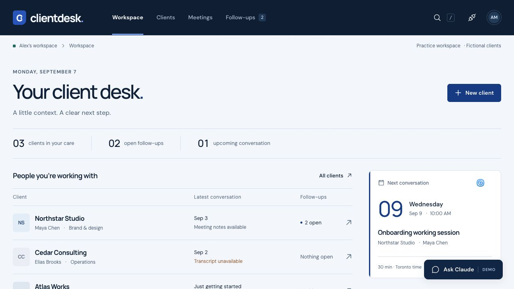
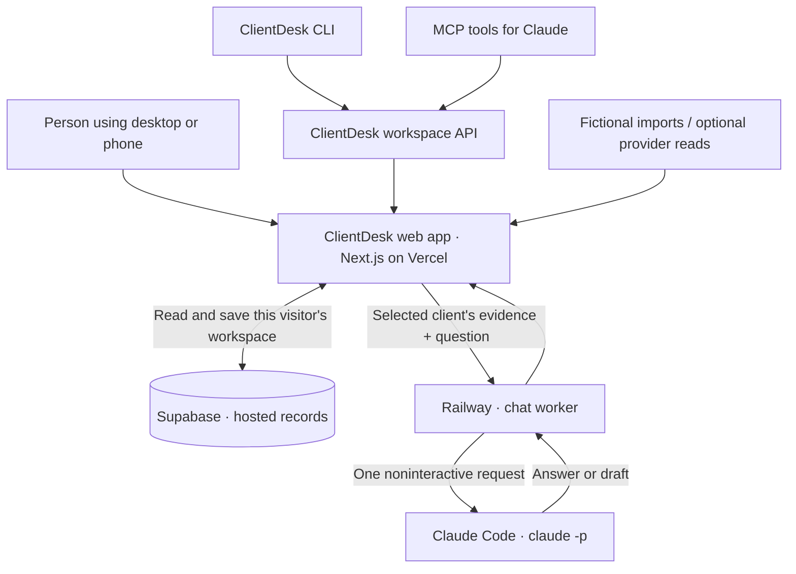

# ClientDesk

### From a vague idea to a working app—with the artifacts to build it again.

ClientDesk is a small CRM for a solo consultant. It brings clients, meeting notes, upcoming calls and follow-ups into one workspace, with Claude chat that can explain the evidence behind a suggested next step.

This is the reference project for **Claude Code for Everyone: Next Steps**, taught by Mark Kashef of Prompt Advisers. Follow the same path as the course: plan the product, define its design, build and inspect it, connect its tools, deploy it, and package a skill another person can run.

**[Before you join](BEFORE-YOU-JOIN.md)** · **[Download the slides](slides/ClientDesk_Course_End_to_End.pptx)** · **[Try the live app](https://clientdesk-course.vercel.app)** · **[Start here](00-course-map/START-HERE.md)** · **[Complete build walkthrough](00-course-map/END-TO-END.md)** · **[Exact course prompts](00-course-map/COURSE-PROMPTS.md)**



*Actual hosted reference, using fictional clients. Screenshot dates are sample content. Hosted chat works on desktop and phone and requires the separately supplied course access code.*

## Start with the result

Open **Northstar Studio** in the live app or your local copy:

1. Read the latest meeting and inspect its original source.
2. Prepare a follow-up. Review the proposed title, owner and date before saving.
3. Reload to confirm the saved task is still there; complete or reopen it.
4. Export a pre-call brief as Markdown.
5. With chat configured, ask: *“What did Northstar ask for, and what is still undecided? Cite the source.”*
6. Try a client with no meetings. A useful response should acknowledge missing evidence.

You can also create and search clients, inspect upcoming calls, and import fictional meeting and calendar records. Importing the same source twice updates its existing record instead of creating a duplicate.

## Choose your route

| Your goal | Start with |
| --- | --- |
| Run the finished app on your computer | The quick start below |
| Rebuild it yourself with Claude | [15-stage end-to-end guide](00-course-map/END-TO-END.md), then [plain-English rebuild brief](01-planning/REBUILD-GUIDE.md) |
| Understand exactly what the app must do | [Specification](01-planning/SPEC.md) and [acceptance milestones](01-planning/MILESTONES.md) |
| Follow the course or teach it | [Course prompts](00-course-map/COURSE-PROMPTS.md), [instructor script](00-course-map/INSTRUCTOR-SCRIPT.md) and [rehearsal](00-course-map/REHEARSAL.md) |
| Put your own copy online | [Hosted setup](05-deployment/SETUP.md) and [Railway Claude chat](05-deployment/HOSTED-CLAUDE-CHAT.md) |

The reference includes working source and lockfiles. A fresh build from the prompts may produce different code; compare it against the specification and repeat the checks on your own implementation.

## Run locally

**You need Node.js 24 and npm.** Claude Code, signed into your own account, is needed for the guided build and optional local chat. The basic CRM can run without Claude, a cloud database or provider credentials.

Download this repository with GitHub’s **Code → Download ZIP**, then extract it. Or clone it:

```sh
git clone https://github.com/promptadvisers/claude-code-next-steps.git
cd claude-code-next-steps
```

This repository root is the **Walkthrough Assets** folder referred to in the slides. Open it as your Claude Code project. In a normal terminal:

```sh
node 00-course-map/prepare-demo.mjs
cd 03-build/clientdesk
npm ci
npm test
npm run typecheck
npm run dev
```

Open **[http://127.0.0.1:4310](http://127.0.0.1:4310)**. Leave that terminal running. Use a second terminal for further commands.

The preparation script refreshes the fictional course dates and demo context. `npm ci` installs the locked dependencies. With no `.env.local`, the app saves practice data locally in SQLite under `.data/`. Keep that private generated folder out of Git and course distributions.

**Prefer a plain-English request?** Paste this into Claude Code with this project open:

> Read README.md and 00-course-map/START-HERE.md. Check the required software, help me install anything missing, and start the supplied reference app. Explain each step. Use the fictional local data first. Show me how to open Northstar, review a follow-up, save it and confirm it after reload.

## How the pieces fit together



**Vercel serves the app. Supabase stores hosted workspaces. Railway runs Claude Code.** In local mode, SQLite replaces Supabase and optional chat uses the Claude installation on your computer.

An **API** is an interface programs call. A **CLI** lets you request something through a terminal. **MCP** exposes named tools an assistant can discover and call. In this project, CLI and MCP both reuse the app's API; they are two entry points, not a mandatory API → CLI → MCP chain. See the [connection primer](00-course-map/CONNECTION-PRIMER.md) and [architecture notes](02-design/ARCHITECTURE.md).

## Claude chat, in plain English

**Headless means Claude runs without its usual interactive conversation screen.** The app sends a question and context, Claude returns a result, and the app displays it. `-p` is Claude Code's print-mode option:

```sh
claude -p "Explain what a CRM does in one sentence."
```

The working integration adds controlled input, structured output, timeouts and tool restrictions. It is more than putting a shell command behind a chat box.

| Mode | Where Claude runs | Setup |
| --- | --- | --- |
| Local chat | Your computer, using your signed-in Claude Code account | [Local chat guide](05-deployment/LOCAL-CLAUDE-CHAT.md); opt in with `CLIENTDESK_LOCAL_CHAT=1` in the app's private `.env.local` |
| Hosted course chat | A separate Railway worker, reached through the Vercel app | [Hosted chat guide](05-deployment/HOSTED-CLAUDE-CHAT.md); persistent authentication, service token and course access code |

The local subprocess route is disabled on Vercel. The hosted Railway route is a separate implementation and is available on phone and desktop. **Print mode still consumes account usage allowance; it is not free or unlimited inference.** Check your account's current plan and extra-usage settings before running your own service.

### What does chat know?

The app supplies the selected client's profile, up to four recent meetings, ten calendar records, twenty tasks and the last six chat messages. Long text is excerpted. It does not send every client, arbitrary course files, or provider records that have never been imported.

The worker has no database credentials. Claude receives a bounded snapshot from the app, with source IDs. It has no filesystem, MCP or database-write tools in this chat path. Draft follow-ups still require the app's explicit review and save flow. Conversations live in the current page's memory; reloading starts a new chat. Saved CRM records remain in storage.

## Everything needed to understand the build

| Location | What it contains |
| --- | --- |
| [00-course-map](00-course-map/START-HERE.md) | Ordered walkthrough, exact prompts, six labs, instructor narration, demo preparation and headless examples |
| [01-planning](01-planning/BRIEF.md) | Brief, complete specification, milestones, decisions, rebuild instructions and fictional source records |
| [02-design](02-design/DESIGN.md) | Navy visual direction, Manrope and DM Sans fonts, tokens, brand assets and architecture |
| [03-build/clientdesk](03-build/clientdesk/README.md) | Next.js/React app, TypeScript domain logic, storage, migrations, adapters, CLI, MCP and tests |
| [03-build/clientdesk-chat](05-deployment/HOSTED-CLAUDE-CHAT.md) | Railway worker, Dockerfile, pinned Claude Code dependency, authentication helper and tests |
| [04-verification](04-verification/VERIFICATION.md) | Recorded test evidence and screenshots; rerun the checks for your own build |
| [05-deployment](05-deployment/SETUP.md) | Vercel/Supabase instructions, local and hosted chat guides, deployment receipts |
| [.claude](.claude/skills/client-brief/SKILL.md) | Reusable client-brief skill, examples, template, interface rule and optional hook configuration |
| [BUILD-LOG.md](BUILD-LOG.md) | Actual implementation decisions, fixes and verification history |

The prompts are reusable teaching prompts, not a claimed verbatim transcript of development. This public course companion contains the sanitized source and documents, plus the current [160-slide PowerPoint](slides/ClientDesk_Course_End_to_End.pptx). Instructor authoring files, previous decks, private session notes and account credentials remain in the private archive.

## Connect the CLI, MCP and reusable skill

Keep the app running. From `03-build/clientdesk`, inspect the supported terminal commands:

```sh
npm run cli -- --help
```

For MCP, start Claude Code from **this repository root**, review the project's [.mcp.json](.mcp.json), approve the trusted server and inspect `/mcp`. Then ask:

> Use ClientDesk tools to find Northstar's latest meeting. Cite the source ID, explain which follow-up is supported, and identify what remains undecided. Do not save a task.

The browser has its own practice identity. CLI and MCP share a separate practice session by default, so an import in one workspace will not automatically appear in another.

The [/client-brief skill](.claude/skills/client-brief/SKILL.md) packages a repeatable briefing workflow. Use its argument hints and the current [demo context](00-course-map/DEMO_CONTEXT.md). The [end-to-end guide](00-course-map/END-TO-END.md) explains how to test and distribute it, including the optional hook example.

## Deploy your own copy

Follow stages 9–14 of the [complete walkthrough](00-course-map/END-TO-END.md) in order:

1. Create your own Supabase project, enable anonymous practice sign-in and apply **both** [database migrations](03-build/clientdesk/supabase/migrations) in filename order. Check isolation with two identities.
2. Deploy `03-build/clientdesk` to Vercel with Node 24 and your Supabase configuration. Verify saved records at the hosted URL.
3. Deploy `03-build/clientdesk-chat` to Railway using its Dockerfile and a persistent `/data` volume. Complete the documented Claude sign-in on the worker.
4. Configure the private service token and course access code. Connect Vercel to the worker using the exact app origin, then redeploy.
5. Ask a real question through your hosted app. Verify sources, missing evidence, incorrect access codes, cancellation and phone layout.

Environment variable names and setup details are in the linked deployment guides. Credentials, account sessions, course access codes, local database files and `.vercel` metadata must stay out of the repository. Your new deployment requires your own accounts and verification.

## Verify the result

The [public release checks](04-verification/PUBLIC-RELEASE.json) passed on Node 24: 24 app tests, 6 worker tests, both typechecks, a production build and local HTTP persistence/isolation checks. These publication checks did not redeploy the hosted services.

Run from `03-build/clientdesk`:

```sh
npm test
npm run typecheck
npm run build
# With the local app running in a separate terminal:
npm run test:http
```

For the worker, run from `03-build/clientdesk-chat`:

```sh
npm ci
npm test
npm run typecheck
```

Automated checks cover different parts of the system. Also inspect the real browser, save and reload a task, test a second identity, and obtain an actual hosted Claude answer. A mocked worker test does not prove a deployed account is authenticated. See [verification notes](04-verification/VERIFICATION.md) and the [hosted verification receipt](04-verification/hosted-claude-live.json).

## Common sticking points

| What you see | What to check |
| --- | --- |
| The local app will not start | Use Node 24, run `npm ci` in the app folder, and check whether port 4310 is already in use. |
| Ask Claude is missing locally | Follow the local opt-in guide, sign in to Claude Code and restart the development server. |
| Hosted chat is unavailable | Check worker health, authentication, course code, matching service tokens and the exact Vercel origin; follow the hosted guide. |
| An imported record is missing in another view | Confirm you are using the same practice identity; browser and CLI/MCP sessions differ. |
| Hosted saves fail | Check both migrations, anonymous sign-in, Supabase environment configuration and the deployed app's actual response. |
| Demo dates look old | Run the preparation script in an exercise copy and follow the guide for using refreshed sample data. Existing saved workspaces are separate. |

## Scope and responsible reuse

This is a **fictional course practice CRM**. It includes durable hosted storage and visitor isolation. Named accounts, account recovery and shared team workspaces are not implemented. Clearing browser identity state may lose access to that practice workspace.

Fireflies and Calendly adapters exist, but live provider reads are optional and are not represented as verified connections. Provider logos identify example services; they do not imply endorsement. Font licenses and asset provenance are included in the [design assets](02-design/ASSETS.md).

Use the completed reference to learn, compare and recover from a stalled exercise. Use the specification and your own checks to establish what your rebuilt version actually does.
